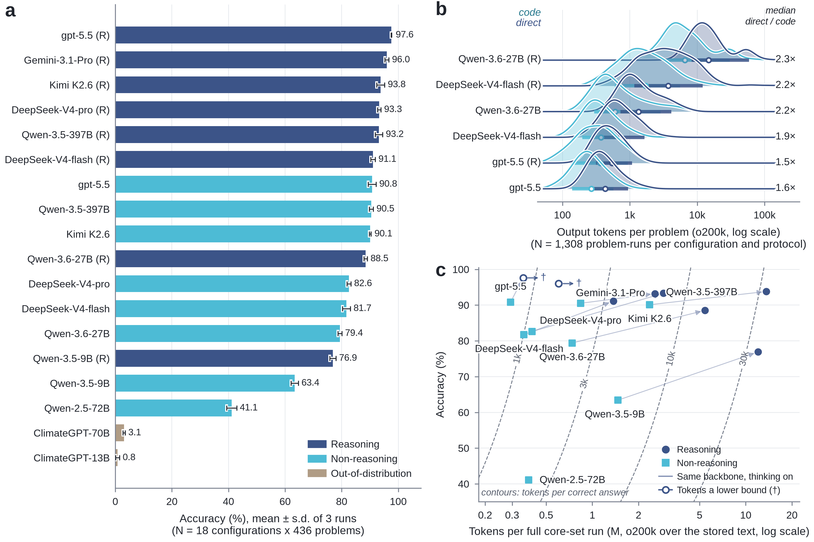

# AtmosCoder-Bench

**Execution-grounded evaluation of large language models on atmospheric-science computation.**

Each problem gives the model only the problem statement; formulas that the textbook
originally supplied are stripped out. The model writes a Python `solve()` function, the
harness executes it in an isolated sandbox, and the numerical output is graded against
certified ground truth at 5% relative tolerance with unit reconciliation. The prose is never
parsed for answers: the score comes from running the code.

<p align="left">
  
  
  
  
</p>

> **Paper**: *Execution-grounded evaluation reveals limits of language-model judgement in
> atmospheric science* (under review). Preprint and citation entry will be linked here on
> posting.

## Findings

1. **Multiple-choice scores overstate computational ability.** On the same 670 problems,
   picking a letter scores 30–45 points higher than computing the answer. Correcting for
   guessing and grading tolerance leaves 20–39 points; removing the source benchmark's own
   defective answer keys still leaves 12–27.
2. **Most failures are not missing knowledge.** Models usually identify the correct formula,
   then fail to apply it consistently over many steps: truncated iterations, constraints and
   signs lost midway through a derivation, or code that executes a different method than the
   prose describes.
3. **The bottleneck for frontier models is judgement, not calculation.** When one stated
   condition makes the standard method invalid, models tend to apply it anyway. The failure
   rate on such trap problems falls from 36% to 3% as capability rises, but reaches zero for
   no model, and enabling reasoning narrows the gap without closing it.

Sections below give the numbers; `docs/results/` has the full analysis for each experiment.

## How it works


Two protocols share the same system message and differ in who does the arithmetic. In `code`
mode the model returns a `solve()` function, which runs in a sandboxed subprocess with a hard
timeout. In `direct` mode the model works in prose and reports a boxed number. Both are graded
by the same unit-aware numeric comparison.

If a response cannot be graded (the code does not run, or there is no boxed value), it is fed
back with the error for up to five attempts. Retries only fix format problems: a wrong but
runnable answer is final and is not retried.

## Results

16 configurations (nine backbones, five developers), three runs each, on the 436-problem core
set. Accuracy ranges from 97.6% to 41.1%.



| Model | Code-mode accuracy | Tokens / run |
|---|--:|--:|
| gpt-5.5 (reasoning) | **97.6 ± 0.1** | 0.35 M † |
| Gemini-3.1-Pro (reasoning) | 96.0 ± 0.7 | 0.60 M † |
| Kimi K2.6 (reasoning) | 93.8 ± 1.4 | 13.61 M |
| DeepSeek-V4-pro (reasoning) | 93.3 ± 0.6 | 2.91 M |
| Qwen-3.5-397B (reasoning) | 93.2 ± 1.3 | 2.56 M |
| DeepSeek-V4-flash (reasoning) | 91.1 ± 0.8 | 1.37 M |
| gpt-5.5 | 90.8 ± 1.4 | 0.29 M |
| Qwen-3.5-397B | 90.5 ± 0.7 | 0.84 M |
| Kimi K2.6 | 90.1 ± 0.3 | 2.37 M |
| Qwen-3.6-27B (reasoning) | 88.5 ± 0.6 | 5.43 M |
| DeepSeek-V4-pro | 82.6 ± 0.7 | 0.40 M |
| DeepSeek-V4-flash | 81.7 ± 1.4 | 0.36 M |
| Qwen-3.6-27B | 79.4 ± 0.7 | 0.74 M |
| Qwen-3.5-9B (reasoning) | 76.9 ± 1.1 | 12.04 M |
| Qwen-3.5-9B | 63.4 ± 1.3 | 1.47 M |
| Qwen-2.5-72B | 41.1 ± 1.8 | 0.38 M |

Mean ± s.d. over three runs. Tokens are recounted from the stored text with a single tokenizer
(`o200k`), not taken from provider billing. † These two endpoints return only a summary of the
chain of thought, so their counts are lower bounds and are excluded from efficiency
comparisons. Full tables, per-run values and reliability metrics:
[`docs/results/CORE_RESULTS.md`](docs/results/CORE_RESULTS.md).

### Multiple-choice comparison

On the same 670 problems from a published MCQ benchmark, picking a letter scores 30–45 points
higher than computing the answer. After correcting for four-way guessing and regrading the
computed side at ±20% tolerance, the gap is 20–39 points. An audit of the source answer keys
flagged 19 of the 67 templates as defective; on the clean subset the corrected gap is still
12–27 points.

A common pattern in the responses: the model derives the same wrong value in both modes, then
picks the closest printed option. See
[`docs/results/MCQ_RESULTS.md`](docs/results/MCQ_RESULTS.md) and
[`docs/results/MCQ_DATASET_AUDIT.md`](docs/results/MCQ_DATASET_AUDIT.md).

### Trap problems

A trap changes one detail of a certified problem so that the standard method for the parent
problem produces a specific wrong answer. Each of the 67 traps stores that predicted answer as
an executable solver, which separates "took the shortcut" from other failures; the unmodified
parent problem serves as the control.

The Trap Gap (failure rate on traps whose parent the model solves) drops from 36 pp on the
weakest configuration to 3 pp on the strongest. Enabling reasoning reduces it for every
backbone but does not remove it. Regime-boundary traps, where a stated condition moves the
problem outside the standard method's range of validity, are the hardest family (42% pooled
solve rate). Traps were admitted only if a frontier configuration could recover the correct
answer, so the 3 pp at the top is a lower bound. See
[`docs/results/TRAP_RESULTS.md`](docs/results/TRAP_RESULTS.md).

### Other results

- **Numeric and paraphrase variants.** Variant answers are recomputed at newly drawn inputs,
  so a memorised answer cannot transfer. No configuration shows a significant core-vs-variant
  gap; shifts smaller than about 2 points would go undetected at this sample size.
  [`VARIANT_RESULTS.md`](docs/results/VARIANT_RESULTS.md)
- **Fabricated execution.** 10 confirmed cases of models describing runs that never happened,
  all in smaller models (lexical scan, so a lower bound). The claim has no effect on the
  score, because the graded number always comes from actually running the code.
  [`FABRICATION_RESULTS.md`](docs/results/FABRICATION_RESULTS.md)
- **Scaffolding.** Removing the formulas and constants the textbook handed over costs the
  strongest model 1.8 points and a 9 B model 18.5.
  [`SCAFFOLDING_ABLATION.md`](docs/results/SCAFFOLDING_ABLATION.md)
- **Cross-domain.** 131 problems built with the same pipeline in hydrology, environmental
  chemistry, ecology, and soil mechanics reproduce the model ordering exactly
  (Spearman ρ = 1.00). [`CROSS_DOMAIN_RESULTS.md`](docs/results/CROSS_DOMAIN_RESULTS.md)
- **Prompt sensitivity.** Frontier models move at most 2 points between two prompt phrasings;
  the 9 B model loses 10.7, mostly through code that no longer runs.
  [`PROMPT_SENSITIVITY.md`](docs/results/PROMPT_SENSITIVITY.md)

## Dataset

436 self-contained problems from 13 published textbooks, in ten categories and three
difficulty levels, with 734 graded sub-answers (multi-part problems ask up to fourteen).
Together with the perturbation families this gives 4,346 evaluated instances and 7,029 graded
quantities.

| File | Count | Contents |
|---|--:|---|
| `benchmark/core.json` | 436 | Verbatim statement, source, executable reference solver, certified answers, category, difficulty |
| `benchmark/variants_numeric.json` | 1,730 | Inputs re-sampled, ground truth recomputed by a full-precision solver twin (contamination probe) |
| `benchmark/variants_paraphrase.json` | 2,180 | Reworded, values and answer unchanged (robustness probe) |
| `benchmark/traps.json` | 67 | Single-trigger perturbations, each storing its predicted shortcut as an executable solver |
| `benchmark/scaffolding_ablation/` | 169 pairs | The same problem with and without the knowledge the textbook handed over |
| `benchmark/cross_domain/` | 131 | Hydrology, environmental chemistry, ecology and biogeochemistry, soil mechanics |
| `benchmark/external/` | 670 | The AtmosSci-Bench MCQ10 set, converted for the format-comparison experiment |

[`benchmark/README.md`](benchmark/README.md) is the dataset card.

## Quickstart

Requires Python ≥ 3.13 and [uv](https://docs.astral.sh/uv/). Dependency versions are pinned in
`uv.lock`.

```bash
uv sync

# 1. Verify the released corpus: re-execute every reference solver against its
#    stored answer. No API keys, no model calls.
uv run python -m eval.verify --set core -t 0.05

# 2. Configure your models (file is gitignored; fill in your own keys).
cp models.example.toml models.toml

# 3. Evaluate a model.
uv run python -m eval.runner --model gpt-5.5 --set core --exp-id core_code

# 4. Analyze stored runs (offline, no model calls).
uv run python -m eval.analysis.accuracy --exp-id core_code --tols 0.01 0.05 0.10
uv run python -m eval.analysis.robustness
```

Evaluatable sets (`--set`): `core`, `variants_numeric`, `variants_paraphrase`. Probe sets run
with `--input <file>` (e.g. `benchmark/traps.json`). Protocols (`--mode`): `code` (default),
`direct` (prose + boxed answer), `agent` (stateful REPL). Every configuration in the paper was
run three times (`--run N`).

### Solver contract

A submitted `solve()` must take every given value as a parameter with a default, use only the
Python standard library, perform unit conversions explicitly, and return
`{"sub_id": {"value": number, "unit": str}, ...}` in the order asked. Grading is answer-keyed
and unit-aware: a correct answer in a commensurate unit passes.

## Repository layout

| Path | Contents |
|---|---|
| `benchmark/` | The released corpus and its dataset card (table above). |
| `eval/` | Evaluation harness: runner, isolated execution engine, unit-aware grader, model-provider layer, and the offline analysis modules (`eval/analysis/`) that regenerate every reported statistic from stored runs without further model calls. |
| `pipeline/` | The construction and certification chain, one module per stage: extraction, blind solver generation, cross-model certification, the deterministic faithfulness auditor, de-scaffolding, variant generation, trap construction, annotation, and the external-MCQ key audit. |
| `docs/` | Per-experiment analysis (`docs/results/`), construction and quality-assurance documentation (`docs/dataset/`), and the verbatim response traces behind every case study (`docs/evidence/`). |
| `supplement/` | Figure-generation scripts, the numerical table behind every figure (`figure_data/`), and generated figure descriptions (`FIGURES.md`). |
| `figures/` | Construction-pipeline and protocol schematics. |

Per-run model outputs (~5 GB, 273 result files) are not tracked here. The complete archive is
on [Google Drive](https://drive.google.com/file/d/1zkm3Uj77uWmHAw6T8s_lU6kos6vquCAC/view?usp=sharing);
unpack it as `experiments/` at the repository root and the `eval.analysis` commands above run
against it unchanged. It will also be deposited in a versioned public data repository on
publication.

## Construction


Problems come from 13 published textbooks, with per-problem source attribution. Where the book
publishes an answer, ground truth must reproduce it; otherwise three blind solvers from
different developers must agree on the value. Every admitted solver also passed a
deterministic audit against hard-coded answers and unused inputs, and human review. Language
models propose candidate solvers, answers, and rewordings; admission is decided by execution,
the textbook anchor, cross-developer agreement, and expert sign-off.

See [`docs/dataset/QUALITY_ASSURANCE.md`](docs/dataset/QUALITY_ASSURANCE.md) and
[`docs/METHODS.md`](docs/METHODS.md) for details. The source PDFs are copyrighted and not
redistributed. `benchmark/external/` re-hosts the AtmosSci-Bench MCQ10 problem set
(arXiv:2502.01159) in converted form, with attribution.

## License

Code is released under the MIT License (see `LICENSE`). The benchmark problem statements are
derived from published textbooks and are provided for research evaluation purposes with
per-problem source attribution.

## Citation

```bibtex
% Citation entry will be added on posting.
```
