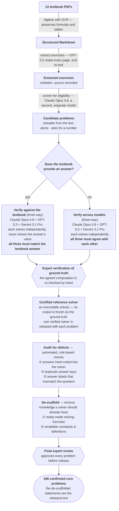
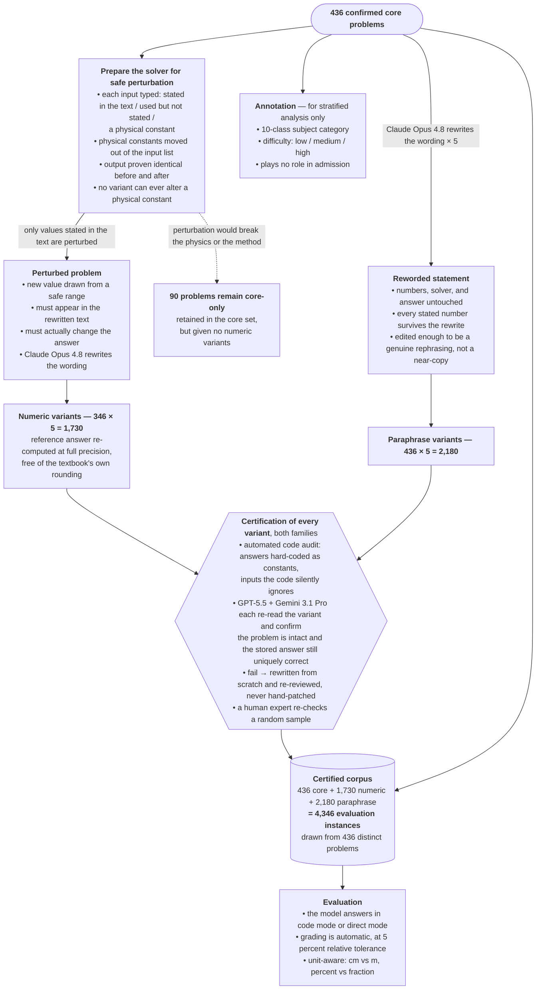
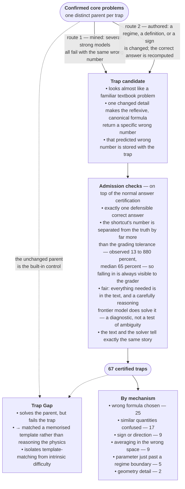

# AtmosCoder-Bench: Dataset Construction and Composition

This document describes how AtmosCoder-Bench is built and certified, and what the
released corpus contains. It is written to be self-contained for a paper's *Dataset*
section; the final table maps every construction stage to the pipeline module that
implements it, for reproducibility.

## Overview

AtmosCoder-Bench is constructed through an **execution-grounded** pipeline that turns
atmospheric-science textbook problems into a programmatically verifiable benchmark.
Every problem is paired with an executable reference solver whose output *defines* the
ground truth, and every artifact passes multiple **independent** verification gates
before admission; problems failing any stage are discarded unless they can be repaired
and re-verified. The released corpus comprises **436 confirmed core problems** drawn
from thirteen undergraduate- and graduate-level textbooks. Every core problem carries
five certified **paraphrase** variants (436 × 5 = 2,180); the **346** problems whose
inputs admit safe perturbation additionally carry five certified **numeric** variants
(346 × 5 = 1,730) — **4,346 evaluation instances** in total. The model under test sees
*only the problem text* — no formulas beyond those intrinsic to the problem, and no
expected answer.

The construction is summarized in three stage diagrams: **(A)** core-set construction,
in three phases — *source curation*, *solver synthesis and answer verification*, and
*quality control and release* — from textbook PDFs to the 436 confirmed core problems
(§1–§3, §8–§9); **(B)** variant generation, annotation, and certification — the numeric
and paraphrase families and their shared author–reviewer certification, ending at the
4,346-instance evaluated corpus (§4–§7, §10–§11); **(C)** the trap diagnostic family.

**Diagram A — Core-set construction (§1–§3, §8–§9).**

*Problems failing any stage are discarded unless they can be repaired and re-verified.*

**Diagram B — Variant generation, annotation, certification, and grading (§4–§7, §10–§11).**

**Diagram C — Trap diagnostic family (held out from the main corpus; leaderboard
denominators unaffected).**

## 1. Source Curation

Source textbooks are digitized from PDF to structured Markdown using a hosted OCR
service with formula and table recognition enabled, so formulas and tables are
preserved rather than garbled (large books are split to respect the per-file page
limit, with per-chunk caching). Curation then proceeds in two passes by two different
models:

1. **Extraction** — **GPT-5.5** reads the digitized book **page by page, end to end**,
   and records every exercise it encounters, so coverage is exhaustive rather than
   sampled. Each extracted item stores its verbatim statement and its source (book and
   chapter).
2. **Eligibility screening** — an independent review by **Claude Opus 4.8**, a second
   model separate from the extractor, checks each extracted item before it may enter
   the pipeline: the statement must be **solvable from the text alone** (no reference
   to external figures, tables, datasets, or neighboring exercises), must **ask for a
   number**, be free of OCR corruption, and state every quantity its solution needs.
   Items that ask for a proof rather than a number, or that depend on an external
   figure or dataset, are discarded here.

Only items surviving both passes become **candidate problems**. A candidate is promoted
to a *core problem* only after the downstream stages: solver synthesis and answer
verification (§2–§3) and the quality-control stages of §8–§9, ending in a **final
expert review** of the released form before admission.

## 2. Executable Solver Synthesis and the Answer Contract

The reference solver is the benchmark's foundation: rather than pairing each problem with
a statically annotated answer, we pair it with an **executable `solve()` whose output
*defines* the ground truth**. This choice does three things at once. It makes the ground
truth **deterministic and reproducible** — anyone who re-runs the code recovers the same
value, with no dependence on a hand-computation or a possibly-misprinted textbook number.
It **separates method knowledge from arithmetic execution** — because all computation is
delegated to a deterministic interpreter, a model is tested on whether it can translate the
physics into a correct procedure, not on its mental arithmetic. And it is what makes the
**numeric-variant family possible at all** (§5): since the answer is "the solver's output on
a given input," perturbing the stated numbers and re-running the solver yields a trustworthy
new answer automatically — impossible if the answer were a fixed label.

For every problem a `solve()` function is synthesized under a strict contract:

- every value *given* in the problem becomes a function parameter carrying its stated
value as a default;
- only the Python standard library may be used;
- all unit conversions are performed explicitly in code;
- the return value is `dict[str, {"value": number, "unit": str}]`, keyed by sub-part id
in the order asked.

This contract offloads arithmetic to a deterministic interpreter, isolating *method
knowledge* from arithmetic execution and making grading reproducible. Solvers are
authored **blind** — no model is ever shown the answer's value — and retained only if
they execute. During verification (§3) each of the three participating models writes
its own solver; the one **released** with the problem is the one authored by a single,
pre-designated model (Claude Opus 4.8) under this contract, so release quality is
uniform and no post-hoc selection among agreeing solvers occurs. Because admission
requires all solutions to agree (§3), the frozen ground-truth value does not depend on
this choice.

## 3. Answer Verification

The verification route is a property of the source book and is decided first: **does
the textbook provide an answer?** Both routes are **three-way**: the same three
frontier models, one per developer — **Claude Opus 4.8**, **GPT-5.5**, and
**Gemini 3.1 Pro** — each independently writes and runs an executable solver from the
problem text alone. No model is ever shown the answer's *value*; on the
textbook-anchored route each is told only the answer's *units and count*, so a correct
derivation reported in SI remains commensurable with a book answer expressed in mixed
units.

- **Verify against the textbook** (the book provides an answer). The reference is the
textbook's printed answer, and a problem is admitted only when **all three solutions
match it** within tolerance. Agreement certifies two things at once: the *extracted
text* (the problem is solvable exactly as released) and the *printed answer itself*.
The failure modes are diagnostic: models that agree with one another but not with the
book expose a misprinted key, which is corrected and logged as an erratum; models that
disagree with one another expose a damaged or ambiguous extraction, which is repaired
or discarded.
- **Verify across models** (no published answer exists). With no external anchor, a
problem is admitted only when **all three solutions agree with one another**,
sub-question by sub-question, within tolerance; the agreed value becomes the
reference. The two routes differ only in the agreement target — the textbook's answer,
or one another.

In **both routes** the agreed computation is then **re-checked by hand** (*expert
verification of ground truth*). Only then is the value **frozen as the ground truth**
and the **certified reference solver** — one verified, contract-conformant solver per
problem (§2) — released with the problem. A separate **final expert review** later
approves every problem in its released, de-scaffolded (§9) form before it enters the
corpus: models propose, a person signs off.

## 4. Parameterization and Constant Demotion

Each solver parameter is typed as `INPUT_TEXT` (stated in the problem and perturbable),
`INPUT_HIDDEN` (used but not surfaced for perturbation), or `CONSTANT` (a physical
constant). A structural transformation then **demotes** every `CONSTANT` from the solver
signature to a named local, with output proven bit-identical before/after. After this,
variant generation cannot perturb a physical constant even by accident.

## 5. Numeric Variant Generation

Numeric variants are produced by perturbing **only** `INPUT_TEXT` parameters under
layered, machine-checkable safety gates: a perturbation must be drawn from the
text-bound whitelist, must actually appear in the regenerated statement, and must
propagate to a non-trivial change in the solver output (rejecting solvers that ignore
their inputs). The perturbed statement is **rewritten by Claude Opus 4.8**; variant
ground truth is obtained by executing a **de-rounded**, full-precision twin of the
solver at the perturbed point, eliminating textbook-rounding artifacts. Certification
of the result is described in §7.

Not every problem admits safe perturbation: **346 of the 436** qualify and receive
**five** numeric variants each; the remaining **90 are retained core-only** because
re-sampling their inputs would not yield a well-posed twin (inputs compressed into
constants by the phrasing; solution methods that cross a regime boundary under
perturbation; answers that are non-smooth or identically zero in the inputs; or
structural problems exposing no free scalar).

## 6. Paraphrase Variants Generation

A parallel family of **reworded** variants is generated — five per core problem,
covering all 436: **Claude Opus 4.8 rewrites** the problem text while parameters,
solver, and answers are held fixed. A deterministic fidelity gate requires that every
stated magnitude survives the rewrite and that the token-level edit ratio exceeds a
threshold, ensuring genuine rephrasing rather than a near-copy; **GPT-5.5 and
Gemini 3.1 Pro then review each rewording** for semantic equivalence to its parent —
a paraphrase that fails review is **rewritten and re-reviewed** rather than patched.

## 7. Multi-Stage Certification

Variant certification follows one **author–reviewer** pattern across both families:
**Claude Opus 4.8 writes, GPT-5.5 and Gemini 3.1 Pro review** — the author's output is
never admitted on its own judgment.

1. **Faithfulness audit** (deterministic, no model involved): AST- and
  perturbation-based detection of answer values baked in as literals, and of dead
   inputs.
2. **Cross-vendor review**: GPT-5.5 and Gemini 3.1 Pro independently review each
  variant — from the variant text alone, they check that the edit did **not break the
   problem** (it remains self-contained and well-posed) and that the stored ground
   truth is still the uniquely correct answer for the new text. A variant that fails
   review is **rewritten by the authoring model and re-reviewed**; an item on which the
   reviewers converge against the stored value is removed. A unit/sign-tolerant matcher
   separates genuine disagreements from unit-convention artifacts so that correct items
   are not discarded.
3. **Human spot-audit**: a random sample of accepted variants from **both families** is
  additionally reviewed by a human expert as a final integrity check.

## 8. Defect Auditing and Curation

The corpus is audited for ill-posedness with (a) **automated, rule-based checks** —
answers hard-coded into the solver, duplicate answer keys that collapse under grading,
and answer labels that mismatch what the question asks — and (b) a **three-model
consensus** audit of well-posedness
that flags problems embedding a non-numeric sub-question with no graded slot, ordering
or labeling expected answers ambiguously, or otherwise unsolvable as stated. Every
flagged item is then **reviewed manually by a human expert** — automated flags propose,
the expert disposes — before any change is applied. Confirmed defects are repaired to a
well-posed form (and re-verified) or removed; a defective base problem that cannot be
repaired is removed together with its variants.

## 9. Difficulty Calibration via De-scaffolding

To counter saturation by frontier models, core problems undergo a two-pass
**de-scaffolding** that removes knowledge a competent solver should already have,
while preserving solvability:

- **Pass 1 — solving formulas** handed over in the statement (e.g., a virtual-temperature
or lapse-rate relation);
- **Pass 2 — recallable physical constants and canonical definitions** (e.g., gravity,
gas constants, the solar constant, ε = 0.622).

Each candidate edit is admitted only if it survives a **triple gate**: the editing model
reproduces the stored answer from the stripped text (recovery), an independent audit
confirms problem-specific data is intact and the method remains unambiguous, and a
**second, independently developed model reproduces the answer** (cross-validation). Edits
that introduce ambiguity or remove non-recallable, problem-specific information are
reverted. Problem-specific empirical relations and non-standard constants are retained.

The **de-scaffolded (stripped) statements are what enter the released core set**, and they
are the statements the human experts of §3 read at the final review gate. For the
**169** core problems that carried recallable scaffolding *and* remain byte-identical to the
released core, the pre-strip **original** statements are additionally preserved, paired with
their stripped counterparts, in `benchmark/scaffolding_ablation/` (`original.json` /
`stripped.json`; the reference solver and answers are identical across the two versions, so
only the *statement* differs — every stripped statement equals its `core.json` entry exactly).
This paired set is a released artifact in its own right: because a model can be run on both
versions of the same problem, it isolates the **scaffolding effect** (accuracy with vs.
without the handed-over knowledge) from intrinsic difficulty. The removed-content
breakdown, the blind-recovery solvability gate that certified each stripped statement, and
the per-model results are reported in `docs/results/SCAFFOLDING_ABLATION.md`.

## 10. Category and Difficulty Annotation

Each confirmed problem is annotated for stratified analysis (annotations play no role
in admission): a **10-class** atmospheric-environment subject category assigned by
**two-vendor consensus re-identification** (disagreements adjudicated), and an intrinsic
**difficulty** grade (low / medium / high) from a rubric-based score by a reasoning
model. Current distribution: 44 low / 258 medium / 134 high.

## 11. Execution-Based Grading

At evaluation the model sees only the problem text and answers either by writing an
executable `solve()` (*code* mode) or by reporting `\boxed{}` numbers (*direct* mode).
A unified grader applies a relative-error tolerance per sub-answer; supports multiple
acceptable values (e.g., sign or unit conventions); performs positional fallback on key
mismatch; and is **unit-aware**, reconciling answers expressed in commensurate units
(cm vs. m, percent vs. fraction) so that physically correct answers are not penalized
for unit presentation.

## Corpus Composition

**Format.** Problems are single- or multi-part: **298 (68.3%)** ask a single quantity and
**138 (31.7%)** ask two or more (up to 14 sub-answers), for a total of **734 graded
sub-answers** (counting each graded quantity once; entries listing several acceptable
values for the same quantity are not double-counted). Grading is answer-keyed and unit-aware at 5% relative tolerance (§11), so
every item is automatically and deterministically checkable.

**Table 1 — Source textbooks (core set, N = 436).**

| Textbook                                     | Author(s)               | # problems |
| -------------------------------------------- | ----------------------- | ---------- |
| Practical Meteorology                        | Stull                   | 156        |
| Atmospheric Science: An Introductory Survey  | Wallace & Hobbs         | 57         |
| Air Pollution Control Engineering            | de Nevers               | 31         |
| An Introduction to Dynamic Meteorology       | Holton & Hakim          | 31         |
| Introduction to Atmospheric Chemistry        | Jacob                   | 28         |
| An Introduction to Atmospheric Physics       | Andrews                 | 28         |
| Fundamentals of Atmospheric Modeling         | Jacobson                | 26         |
| Atmospheric Chemistry and Physics            | Seinfeld & Pandis       | 25         |
| A Short Course in Cloud Physics              | Rogers & Yau            | 20         |
| Workbook of Atmospheric Dispersion Estimates | Turner                  | 13         |
| Chemistry of the Upper and Lower Atmosphere  | Finlayson-Pitts & Pitts | 12         |
| Air Pollution Control: A Design Approach     | Cooper & Alley          | 7          |
| Air Pollutant Concentration Models           | —                       | 2          |
| **Total**                                    |                         | **436**    |

> Editions/years to be confirmed against the exact copies used before submission;
> "Air Pollutant Concentration Models" (2 problems) may be a chapter of another text —
> if so, merge and report twelve textbooks.

**Table 2 — Subject-category distribution (10-class taxonomy, N = 436).**

| Subject category           | N       | %         |
| -------------------------- | ------- | --------- |
| Atmospheric dynamics       | 116     | 26.6      |
| Atmospheric thermodynamics | 89      | 20.4      |
| Atmospheric chemistry      | 51      | 11.7      |
| Air quality                | 37      | 8.5       |
| Boundary layer             | 32      | 7.3       |
| Cloud physics              | 29      | 6.7       |
| Atmospheric radiation      | 25      | 5.7       |
| Atmospheric aerosols       | 24      | 5.5       |
| Climate dynamics           | 19      | 4.4       |
| Observation & modeling     | 14      | 3.2       |
| **Total**                  | **436** | **100.0** |

**Table 3 — Difficulty distribution (N = 436).**

| Difficulty | N       | %         |
| ---------- | ------- | --------- |
| Low        | 44      | 10.1      |
| Medium     | 258     | 59.2      |
| High       | 134     | 30.7      |
| **Total**  | **436** | **100.0** |

**Table 4 — Benchmark composition.**

| Split               | Instances | Per parent                 | Purpose                                 |
| ------------------- | --------- | -------------------------- | --------------------------------------- |
| Core                | 436       | —                          | primary evaluation                      |
| Numeric variants    | 1,730     | 5 (× 346 eligible parents) | memorization / contamination resistance |
| Paraphrase variants | 2,180     | 5 (× 436 parents)          | linguistic robustness                   |
| **Total**           | **4,346** |                            |                                         |

## Trap Diagnostic Family

Beyond the core set and its variants, AtmosCoder-Bench includes a **trap** family: a
diagnostic that probes whether a model reasons from physics or **pattern-matches a
memorized template**. A trap looks almost exactly like a familiar textbook problem, but
**one detail is changed so that the reflexive method — the canonical formula a solver
reaches for on autopilot — yields a specific *wrong* number**, while careful physical
reasoning yields a different, correct one. (Analogy: "you have 10 apples and give away 3
*oranges* — how many *apples* remain?" — the autopilot answer 7 is wrong; the answer is
10.) The signal purchased is **systematic, convergent failure modes**, not raw difficulty:
a trap can be arithmetically trivial yet still defeat a shortcut.

**Built state.** The set is realized as **67 certified traps** in a separate file,
`benchmark/traps.json`, kept apart from `core.json` so the core-set leaderboard
denominators are unaffected and trap analysis is opt-in. Each trap is a **single-trigger
perturbation of one distinct certified core problem** (67 traps ↔ 67 parents), and that
**untouched parent problem serves as the built-in control**: because the parent's own
canonical method is exactly the shortcut the trap defeats, a model that solves the control
but fails the trap has *provably* applied the template rather than the physics — that gap
(the "Trap Gap") is the measured signal, and it isolates the trap effect from intrinsic
difficulty. Empirical results are reported in `docs/results/TRAP_RESULTS.md`.

**Authoring contract** (forced by code-mode + 5% GT grading). Every trap satisfies:
(i) a **uniquely defensible correct answer**, certified like a core problem; (ii)
**separation** between the shortcut's output and the correct answer large enough that the
trap is visible to the grader. Verified by executing both solvers: for **all 67**, at
least one sub-answer separates by more than **13%** (up to 880%, median 65%), and since
grading requires *every* sub to match, one separated sub suffices. *(The stored
`separation` scalar is not uniformly defined — 63 records hold the first sub-answer's gap,
four multi-sub records the largest — so recompute from `shortcut_values` if the exact
quantity matters.)*;
(iii) **fairness** — every quantity needed for the correct solution appears in the text,
and at least one carefully-reasoning frontier model can solve it (a trap is a diagnostic,
never a test of ambiguity); and (iv) a **predicted shortcut** — each record stores the
naive method (`shortcut_code`) and its full output vector (`shortcut_values`), so a failure
can be confirmed as falling into the trap rather than failing for unrelated reasons.
**Capture must be tested against that vector, not the scalar `shortcut_value`** (the
shortcut's first sub-answer, named in `shortcut_sub`), which can coincide with a correct
answer of a *different* sub: in `trap_snp_49_gen` the scalar 151.6 is also the problem's
own sub-2 answer, so a scalar test flags 25 of its 27 runs where the vector test flags
none — all nine configurations in fact solve that trap, while a genuine shortcut-taker
would fail on all three subs.
**Taxonomy** (by mechanism, current counts): formula-selection 25 (a stated condition
invalidates the canonical formula, e.g. saturation over ice vs. water below 0 °C),
definition-confusion 17 (swapping a defined quantity for its neighbor, e.g. mixing ratio
vs. specific humidity), sign/direction 9, averaging-space 9 (averaging in linear vs.
flux/energy space), regime-boundary 5 (a parameter just past a threshold, e.g. Stokes →
Cunningham slip), and geometry-detail 2.

**Sourcing and certification.** Traps are produced primarily by (a) **mining** existing
evaluation results for core problems where multiple strong models fail with outputs that
**cluster to one wrong value** (empirically-real shortcuts), and (b) **perturbing** a
clean core problem with a regime/definition/sign trigger and recomputing the correct
ground truth. Each candidate passes trap-specific gates on top of normal GT certification:
a deterministic **separation check** (the naive solver runs and differs from GT by >5%),
a **fairness check** (a careful-reasoning model recovers the correct answer), and a
**self-containment audit** (no text/solver desync, no perturbed-constant-only-in-solver),
after which the trap is marked certified.

## External Comparison Set

In addition to the self-built benchmark, an external multiple-choice set (AtmosSci-Bench)
is converted to the same execution-graded contract and audited, providing an independent
point of comparison while being reported separately from the primary corpus.

---

## Stage → Module Map (for reproducibility)

| Stage                                                | Pipeline module(s)                                                                                                            |
| ---------------------------------------------------- | ----------------------------------------------------------------------------------------------------------------------------- |
| 1. Source curation                                   | `pipeline/pdf.py` (MinerU), `extract.py`, `extract_snp.py`                                                                    |
| 2. Solver synthesis                                  | `generate_solvers.py`, `regenerate_solvers.py`                                                                                |
| 3. Verification — against the textbook               | `onboard_solved.py`, `parse_solutions.py`                                                                                     |
| 3. Verification — across models                      | `onboard_snp.py`, `onboard_turner.py`, `certify_gt.py`                                                                        |
| 4. Parameterization / typing                         | `parameterize.py`, `classify_topics.py`, `clean_latex.py`, `type_params.py`, `demote_constants.py`                            |
| 5. Numeric variants                                  | `perturb.py`, `variants.py`, `deround.py`                                                                                     |
| 6. Paraphrase variants                               | `paraphrase.py`                                                                                                               |
| 7. Certification                                     | `faithfulness.py`, `k2_certify.py`, `llm_audit_variants.py`, `llm_audit_paraphrase.py`, `llm_audit_adjudicate.py`, `audit_variants.py` |
| 8. Defect audit / curation                           | `scan_base_defects.py` (deterministic checks + three-model well-posedness consensus), `llm_audit_wellposed.py`, `llm_audit_adjudicate.py`, `fix_structural_defects.py`, `fix_semantic_defects.py` |
| 9. Difficulty calibration + scaffolding-ablation set | `scan_formulas.py`, `descaffold.py`, `strip_info.py`, `verify_descaffold.py`, `llm_audit_scaffolding.py`; paired set in `benchmark/scaffolding_ablation/` |
| 10. Category / difficulty annotation                 | `recategorize.py`, `classify_difficulty.py`                                                                                   |
| 11. Grading core                                     | `eval/engine.py` (`run_solver`, `verify_solver`, `compare_values`)                                                            |
| Trap diagnostic family                               | `generate_traps.py` (author/mine + gate); traps in `benchmark/traps.json`                                                     |
| External MCQ set                                     | `import_atmossci.py`, `audit_mcq.py`                                                                                          |

Verification models used across stages are the user-configured frontier models in
`models.toml` — **Claude Opus 4.8**, **GPT-5.5**, and **Gemini 3.1 Pro**, one per
developer; the released reference solver is authored by Claude Opus 4.8 — invoked
through `eval.models`. Independence is always enforced by requiring agreement *across
distinct developers*.